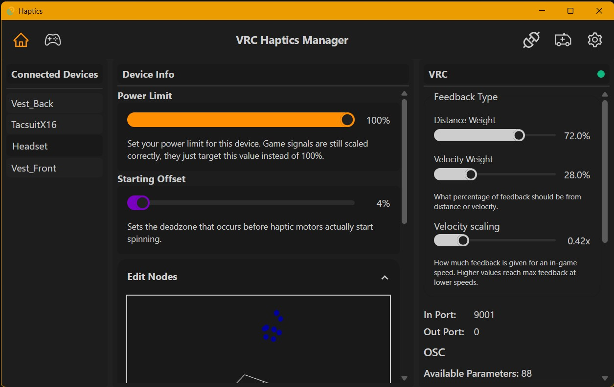

# HAITUS

For personal reasons I am quitting VR. At least for the foreseeable future development has been halted.
Everything I have every worked for on this project is in this Github Org: [https://github.com/VRC-Haptics].

The future and timeline is unknown, but the server currently sits in a state with v0.0.10 where it is full/mostly functional. And even has Linux-x86, and Linux-Arm build support working, as well as a build setup for an Arch package. 
All parts of this project are hosted publicly and in a fully public manner. They may be used, changed, modified, or hosted in any way you see fit. All Repos, snippets, configurations, and other information related to this project are free for anyone to use and modify. 

I still would like to hear about the cool stuff done with this project, but that is not required in any shape or form.

# VRC Haptics

A simple user interface for the haptic server backend. 

Designed from the ground up to run massive haptics arrays in the background with acceptable efficiency and resource usage.

**Layout and look is likely to change**

# Usage

Simply launch the manager when starting VRC or other games, devices will auto connect and the games will auto configure themselves.

## First Time setup

Grab either of the installers from the releases page and click through it.

Everything should configure itself and auto connect if you have either a bhaptics device close by or a native vrch device on the same wifi network.

When starting vrc, the red dot on the **VRC** page on the right side of the screen will turn green when it is connected to a vrc instance.

To connect to a Quest standalone VRC instance the computer running this manager must be connected to the same WIFI network. Running the manager on quest natively is currently not supported.

# Development

## setup:
#### Development
- `pnpm i` -> Installs dependencies (both rust and node)
- `pnpm run tauri dev` -> Start the dev server. 

#### Build:
- `pnpm i` -> Installs dependencies (both rust and node)
- `pnpm run tauri build` -> Builds installer under: `./src-tauri/target/release/bundle/<some_subfolder>`

#### Sidecars:
This project has a few sidecars
 - Windows Registry Editor: `./src-elevated-register`
 - Game Proxy: `./src-proxy`
 - MDNS Listener: `./src-vrc-oscquery/listen-for-vrc`

This is a project VERY early in its development so reporting issues and making contributions (even if they are small) is much appreciated.

## TODO's:

### Backend:
 - Clean up device protocol
 - Add game support
 - Support more BLE devices (only x16 vests are supported)

### Frontend:
 - Re-evaluate frontend frameworks and strategies.
 - Reimplement OTA updates
 - Implement device settings editor
 - Implement Serial device updates

## Recommended IDE Setup

- [VS Code](https://code.visualstudio.com/) + [Tauri](https://marketplace.visualstudio.com/items?itemName=tauri-apps.tauri-vscode) + [rust-analyzer](https://marketplace.visualstudio.com/items?itemName=rust-lang.rust-analyzer)

(I used Jetbrains Rider for the C# sidecars)
